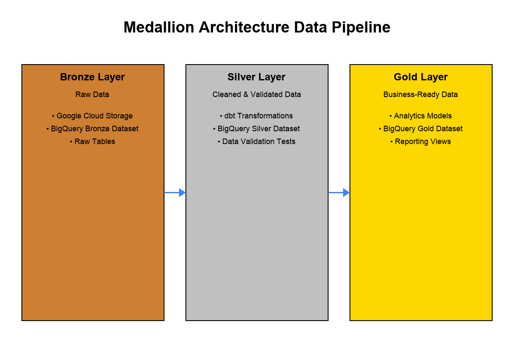

# Medallion Architecture Data Pipeline

A modern data pipeline implementing the medallion architecture pattern using Airflow, dbt, and Google Cloud Platform.

## Overview

This project demonstrates a complete data pipeline using the medallion architecture pattern, which organizes data into three layers:

- **Bronze Layer**: Raw data ingested from source systems
- **Silver Layer**: Cleaned, validated, and transformed data
- **Gold Layer**: Business-ready aggregated data for analytics and reporting

The pipeline orchestrates the movement and transformation of data through these layers using Apache Airflow, with dbt handling the transformations between silver and gold layers.

## Architecture



### Components

- **Apache Airflow**: Orchestrates the entire pipeline
- **dbt (data build tool)**: Handles SQL transformations
- **Google Cloud Storage**: Stores raw data files
- **BigQuery**: Serves as the data warehouse for all layers
- **Great Expectations**: Validates data quality

## Pipeline Flow

1. Raw data is uploaded to Google Cloud Storage
2. Data is loaded into BigQuery bronze datasets
3. dbt transforms bronze data into silver layer with basic cleaning
4. dbt transforms silver data into gold layer with business logic
5. Data quality validations run at each stage

## Setup Instructions

### Prerequisites

- Docker and Docker Compose
- Google Cloud Platform account
- GCP service account with appropriate permissions

### Environment Setup

1. Clone this repository
2. Create a `.env` file with the following variables:
   ```
   GCP_PROJECT_ID=your-project-id
   BIGQUERY_DATASET_BRONZE=medallion_pipeline_bronze
   BIGQUERY_DATASET_SILVER=medallion_pipeline_silver
   BIGQUERY_DATASET_GOLD=medallion_pipeline_gold
   ```
3. Place your GCP service account key file in the root directory as `medallion-dev-6a948fd7a82c.json`

### Running the Pipeline

1. Start the services:
   ```
   docker-compose up -d
   ```

2. Access the Airflow UI at http://localhost:8080 (username: airflow, password: airflow)

3. Trigger the medallion_pipeline DAG

## Project Structure

```
medallion_architecture/
├── bronze/                  # Bronze layer data and scripts
├── silver_layer/            # Silver layer transformations
│   └── transformations/     # dbt project for transformations
├── gold_layer/              # Gold layer output
├── orchestration/           # Airflow DAGs and operators
│   └── airflow/
│       └── dags/            # Airflow DAG definitions
├── tests/                   # Tests for data quality
└── docker-compose.yml       # Docker configuration
```

## Data Quality

Data quality is enforced at multiple levels:
- Bronze to Silver: Basic validation of data types and required fields
- Silver to Gold: Business rule validations
- Final Gold: Analytical consistency checks

## Troubleshooting

If the dbt models fail with validation errors, you can:
1. Check the dbt logs in `/opt/airflow/silver_layer/transformations/logs/`
2. Modify the `run_dbt_commands` function in the DAG to continue despite test failures
3. Fix data quality issues in the source data

## Contributing

Contributions are welcome! Please feel free to submit a Pull Request.

## License

This project is licensed under the MIT License - see the LICENSE file for details. 